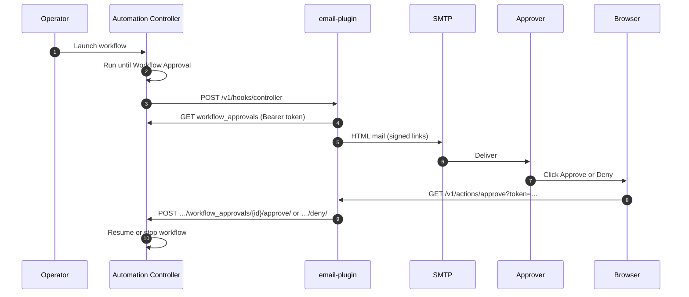

# EMAIL_APPROVAL — workflow mail, `email-plugin`, and optional EDA

Repository: [ypreiger/aap-demo](https://github.com/ypreiger/aap-demo).

**Pod build and env:** [`email-plugin/README.md`](../email-plugin/README.md)  
**Git / EDA bridge (parallel path):** [EDA_GIT_WEBHOOK.md](EDA_GIT_WEBHOOK.md)

---

## 1. End-to-end flow (Controller → mail → Controller)

Automation Controller pauses on a **Workflow Approval** node and POSTs JSON to **`email-plugin`**. The pod resolves the approval, sends **SMTP** mail with **signed Approve/Deny** links, then on click calls Controller **REST** `workflow_approvals/{id}/approve/` or `/deny/`. **EDA is not required** for this loop.



**Webhook body:** Approval Jinja includes **`workflow_url`**, not `job`. Default JSON:

```json
{"workflow_url": {{ workflow_url | tojson }}}
```

```text
Controller (approval waiting)
        │ webhook POST
        ▼
   email-plugin ──SMTP──► Mail user
        ▲                    │
        └── GET signed Approve/Deny ─┘
        └── REST approve/deny ──► Controller (workflow continues)
```

**Optional (Git):** push → **`workshop/git-webhook-bridge`** → EDA webhook + Controller SCM sync → gated workflow → **same** approval and mail path. EDA does not approve jobs; see [EDA_GIT_WEBHOOK.md](EDA_GIT_WEBHOOK.md).

---

## 2. Controller settings

**Administration → Settings → System:** set **Base URL of the service** to the live Controller HTTPS URL used in the browser.

---

## 3. Deploy `email-plugin`

From repository root, with `oc login` to the cluster that hosts AAP:

```bash
cd "$(git rev-parse --show-toplevel 2>/dev/null || pwd)"
SMTP_PASSWORD='<gmail-app-password>' DISABLE_SMTP=false ./email-plugin/scripts/deploy-email-plugin.sh
```

Applies `email-plugin/openshift/`, sets **`CONTROLLER_HOST`** from **`Secret/aap-controller-api`**, builds image, sets **`PUBLIC_BASE_URL`** from **`Route/email-plugin`**.

### Wrong “Open in Controller” link in mail

Patch **`ConfigMap/email-plugin-env`** if needed:

| Variable | Purpose |
|----------|---------|
| **`CONTROLLER_UI_PUBLIC_URL`** | Browser origin for Jobs UI (often gateway + `/…/automation-controller`). |
| **`CONTROLLER_WORKFLOW_JOB_UI_PATH_TEMPLATE`** | Default `/#/jobs/workflow/{workflow_job_id}`. |

```bash
oc patch configmap/email-plugin-env -n aap --type merge -p '{
  "data": {
    "CONTROLLER_UI_PUBLIC_URL": "https://<origin>",
    "CONTROLLER_WORKFLOW_JOB_UI_PATH_TEMPLATE": "/#/jobs/workflow/{workflow_job_id}"
  }
}'
oc rollout restart deployment/email-plugin -n aap
```

---

## 4. Register webhook (default: `bom-project-deploy`)

```bash
EP=$(oc get route email-plugin -n aap -o jsonpath='{.spec.host}')
WH="https://${EP}/v1/hooks/controller"
CH="$(oc get secret aap-controller-api -n aap -o jsonpath='{.data.host}' | base64 -d)"
TK="$(oc get secret aap-controller-api -n aap -o jsonpath='{.data.token}' | base64 -d)"

ansible-playbook email-plugin/playbooks/register_controller_webhook_notification.yml \
  -e controller_host="$CH" \
  -e controller_oauth_token="$TK" \
  -e webhook_target_url="$WH"
```

Creates notification **`bom-email-plugin-webhook`** on **`bom-project-deploy`** approvals.

### Other workflow job templates

Controller sends webhooks **per** workflow template. Register again for each:

| Workflow | Command |
|----------|---------|
| **`email-e2e-ns-netpol`** | `bash scripts/register-webhook-email-e2e-ns-netpol.sh` — details [USECASE_UC07_email_e2e_namespace_netpol.md](USECASE_UC07_email_e2e_namespace_netpol.md) |
| **`workshop-multi-domain`** | Same playbook with `-e workflow_name=workshop-multi-domain -e notification_name=workshop-email-plugin-webhook` |

Operator checklist: [../workshop/CLIENT_RUNBOOK.md](../workshop/CLIENT_RUNBOOK.md) §5–6.

### Gmail and HMAC

- Use a Gmail **App Password** in **`Secret/email-plugin-secrets`** / **`SMTP_PASSWORD`**.
- Optional **`WEBHOOK_HMAC_SECRET`**: inbound POST must send `X-Email-Plugin-Signature: sha256=<hmac>`.

---

## 5. Native Controller SMTP (no `email-plugin`)

When the pod cannot run:

1. Copy `extras/approval-email.vars.example.yml` → `extras/approval-email.vars.yml` (do not commit secrets).
2. Run:

```bash
export CONTROLLER_HOST='https://<controller-route>'
export CONTROLLER_TOKEN='<OAuth PAT>'
ansible-playbook playbooks/controller_configure_bom_approval_email.yml -e @extras/approval-email.vars.yml
```

Red Hat: [Controller notifications](https://docs.redhat.com/en/documentation/red_hat_ansible_automation_platform/2.4/html/automation_controller_user_guide/controller-notifications).

---

## 6. Troubleshooting

| Symptom | Action |
|---------|--------|
| No webhook | Notification not on **this** workflow template; Approvals channel; empty/invalid Jinja body. |
| `email-plugin` **422** | Body must resolve ids — use **`workflow_url`** (see [`email-plugin/README.md`](../email-plugin/README.md)). |
| Gmail auth errors | Rotate App Password; **`SMTP_USER`** matches account. |
| Buttons 400/401 | **`SIGNING_SECRET`** / token expiry; restart Deployment after Secret change. |
| Wrong Controller link | **`CONTROLLER_UI_PUBLIC_URL`** (§3). |
| Egress blocked | Allow pod → SMTP and Controller HTTPS. |
| EDA never receives events | [EDA_GIT_WEBHOOK.md](EDA_GIT_WEBHOOK.md) — **`EDA_WEBHOOK_URL`**, JWT, network. |
