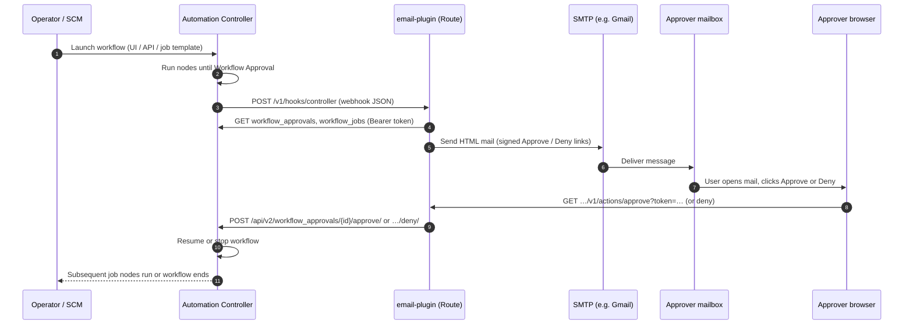
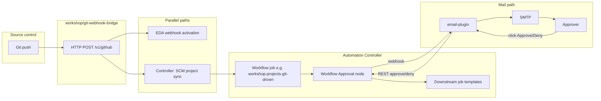

# End-to-end: approval email, `email-plugin`, and EDA

Repository: [ypreiger/aap-demo](https://github.com/ypreiger/aap-demo).

This document describes how **Automation Controller** workflow approvals connect to **`email-plugin`**, outbound **email**, optional **Event-Driven Ansible (EDA)**, and how the run **closes** when the approver **accepts or rejects** the gate.

Related:

- [CONFIGURE_AAP_APPROVAL_EMAIL.md](CONFIGURE_AAP_APPROVAL_EMAIL.md) — deploy, register webhook, Controller base URL  
- [GIT_WEBHOOK_EDA.md](GIT_WEBHOOK_EDA.md) — Git → bridge → EDA + gated workflow  
- [`email-plugin/README.md`](../email-plugin/README.md) — HTTP API and SMTP  

---

## 1. Components

| Component | Role |
|-----------|------|
| **Automation Controller** | Runs workflow job; pauses on **Workflow Approval** node; sends **webhook** JSON to `email-plugin`; exposes **REST** `workflow_approvals/{id}/approve/` and `/deny/`. |
| **Notification template** (webhook) | Associated with the **Workflow Job Template** on the **Approvals** channel. **POST** body must carry enough data for `email-plugin` (e.g. `workflow_url` in Jinja). |
| **`email-plugin` (OpenShift pod)** | Receives webhook; resolves approval id; sends **SMTP** mail with **signed** Approve/Deny URLs; on link hit, calls Controller **REST** to approve or deny. |
| **Mail user** | Reads mail; clicks **Approve** or **Deny** (browser **GET** to `email-plugin` Route). |
| **EDA** (optional) | Receives **events** (e.g. from **`workshop/git-webhook-bridge`** on Git push). Can run rulebooks / dispatch work. **Does not** replace Controller approval; gated flows still stop at the approval node until Controller receives approve/deny. |

---

## 2. Core loop: Controller → `email-plugin` → email → Controller

This is the minimum closed loop for **mail-driven** approval. **EDA is not on the critical path** here.



**Data the webhook must carry:** Controller’s workflow-approval Jinja context includes **`workflow_url`**, not `job`. The registered template should POST JSON such as:

```json
{"workflow_url": "<controller UI URL with /#/jobs/workflow/{id}>"}
```

`email-plugin` derives **`workflow_job_id`**, finds the open **`workflow_approvals/{id}`**, builds mail, and signs action URLs. See [`email-plugin/README.md`](../email-plugin/README.md).

---

## 3. Optional loop: Git → EDA → gated workflow → same approval path

When automation is **triggered by Git** (this repo’s **`workshop/git-webhook-bridge`**), an **EDA** activation can receive a normalized event **in parallel** with Controller work. The **approval gate** is still enforced by Controller; mail flow is unchanged from §2.



Rules from [GIT_WEBHOOK_EDA.md](GIT_WEBHOOK_EDA.md):

- The bridge can **POST** an **`ansible_eda_event`** envelope to **`EDA_WEBHOOK_URL`** when configured.
- The bridge also queues a **project update** so Controller runs playbooks from current Git.
- Webhook-driven workflows that include **`bom-approve-before-vms`** still **wait** at approval; **EDA does not skip** that node.

**Closing the loop with EDA in the picture:**

1. **Git** → bridge → **EDA** (event recorded / rulebook runs / optional side effects).  
2. **Git** → bridge → **Controller** sync + workflow launch → **approval** → **§2** (webhook → mail → REST) → workflow **resumes**.  

EDA “closes” only the **event-processing** side you define in rulebooks (e.g. audit log, ticket, secondary job). **Controller** closes the **approval** state only after **`email-plugin`** (or UI) calls **`approve`/`deny`**.

---

## 4. ASCII overview (single page)

```
                    ┌─────────────────────────────────────────────────────────┐
                    │            Automation Controller                         │
  Launch / Git ────►│  Workflow job → … → Workflow Approval (waiting)         │
                    │       │                                                  │
                    │       │ webhook POST (notification template)             │
                    └───────┼──────────────────────────────────────────────────┘
                            ▼
                    ┌───────────────┐     SMTP      ┌──────────┐
                    │  email-plugin │────────────►│  Mail    │
                    │  (OpenShift)  │             │  user    │
                    └───────┬───────┘             └────┬─────┘
                            │                          │
                            │◄── GET Approve/Deny ───────┘
                            │   (signed link)
                            │ REST approve|deny
                            ▼
                    ┌─────────────────────────────────────────────────────────┐
                    │  Controller: approval cleared → workflow continues     │
                    └─────────────────────────────────────────────────────────┘

  Optional (parallel):  Git ──► git-webhook-bridge ──► EDA (event bus)
                                    │
                                    └──► Controller SCM sync + gated workflow ──► (same approval column as above)
```

---

## 5. Preconditions checklist

1. **`email-plugin`** deployed; **`CONTROLLER_HOST`** / **`CONTROLLER_TOKEN`** valid; SMTP if mail must send.  
2. **Notification** registered on each **Workflow Job Template** that should send mail (**[CONFIGURE_AAP_APPROVAL_EMAIL.md](CONFIGURE_AAP_APPROVAL_EMAIL.md)**).  
3. Controller **System** setting **Base URL of the service** correct for any links Controller renders.  
4. For Git + EDA: bridge **`ConfigMap`** with **`EDA_WEBHOOK_URL`** (and token if required); rulebook activation reachable from cluster.  

---

## 6. Failure points (short)

| Symptom | Check |
|---------|--------|
| No webhook hit | Notification not on **this** workflow template; wrong **Approvals** association; template body empty / invalid Jinja. |
| `email-plugin` **422** | Webhook JSON missing resolvable ids; use **`workflow_url`** body per [`email-plugin/README.md`](../email-plugin/README.md). |
| Mail not sent | **`DISABLE_SMTP`**, **`SMTP_PASSWORD`**, egress to SMTP. |
| Click Approve → error | **`SIGNING_SECRET`** rotation without pod restart; token expired (`TOKEN_MAX_AGE_HOURS`); Controller token revoked. |
| EDA never fires | **`EDA_WEBHOOK_URL`** unset on bridge; activation URL / JWT; network policy. |
